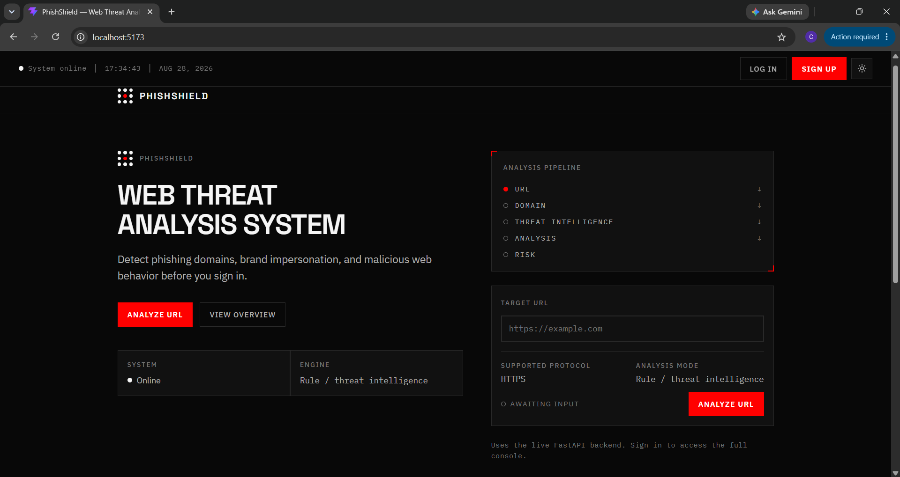
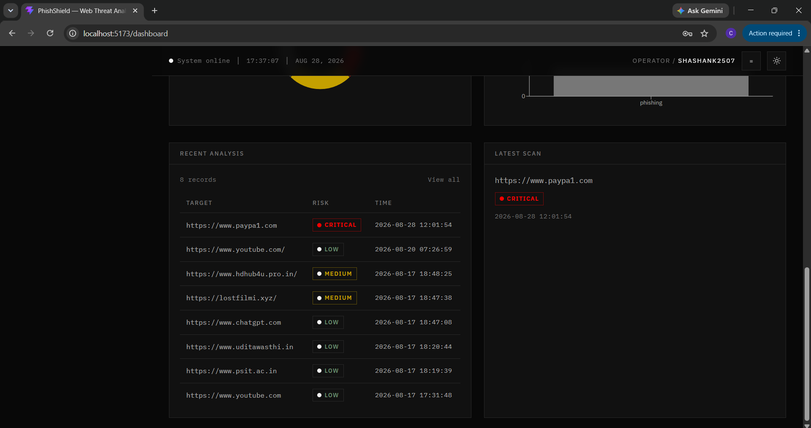
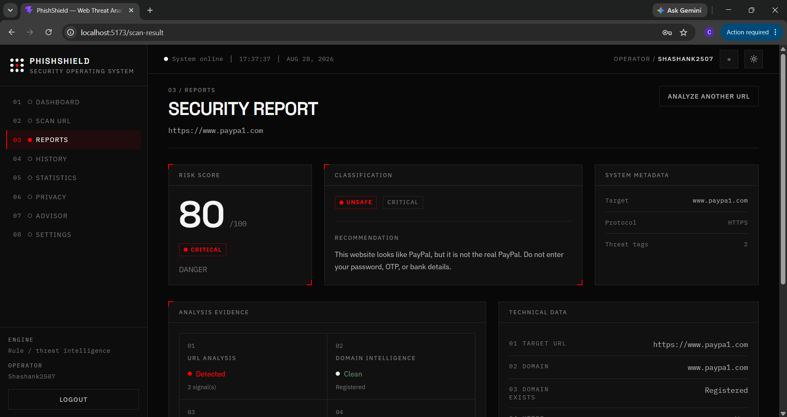
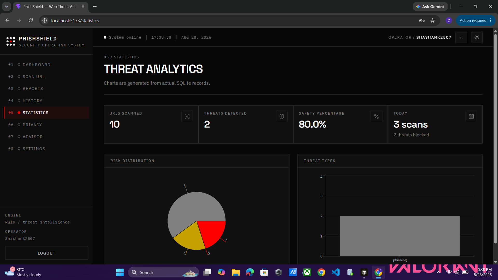

# 🛡️ PHISHEYE

### Intelligent Phishing Domain Detection using AI/ML

<p align="center">
  <a href="https://phisheye-web-fhn5.onrender.com">
    
  </a>
  <a href="https://phisheye-web-fhn5.onrender.com/extension">
    
  </a>
  <a href="https://phisheye-api.onrender.com">
    
  </a>
  <a href="https://phisheye-api.onrender.com/health">
    
  </a>
</p>

<p align="center">
  <strong>Detect suspicious domains. Understand the evidence. Browse safer.</strong>
</p>

---

## 🚀 LIVE PROJECT

<table align="center">
  <tr>
    <td align="center">
      <strong>🌐 Dashboard</strong><br><br>
      <a href="https://phisheye-web-fhn5.onrender.com">Open PHISHEYE →</a>
    </td>
    <td align="center">
      <strong>🧩 Extension</strong><br><br>
      <a href="https://phisheye-web-fhn5.onrender.com/extension">Open Extension →</a>
    </td>
    <td align="center">
      <strong>⚡ API</strong><br><br>
      <a href="https://phisheye-api.onrender.com">Open API →</a>
    </td>
    <td align="center">
      <strong>💚 API Health</strong><br><br>
      <a href="https://phisheye-api.onrender.com/health">Check Status →</a>
    </td>
  </tr>
</table>

---

## 🔴 SYSTEM STATUS

```text
WEB DASHBOARD   ->  ONLINE   https://phisheye-web-fhn5.onrender.com
EXTENSION PAGE  ->  ONLINE   https://phisheye-web-fhn5.onrender.com/extension
BACKEND API     ->  ONLINE   https://phisheye-api.onrender.com
API HEALTH      ->  ONLINE   https://phisheye-api.onrender.com/health
```

---

## 01 — THE PROBLEM

Phishing websites are becoming increasingly difficult to recognize.

Attackers can create domains and webpages that imitate legitimate services by copying their domain names, URL structures, branding, login pages, content, and visual appearance.

Traditional blacklist-based systems are useful for known malicious domains. The harder problem is identifying suspicious domains that are new, modified, or not yet present in known threat databases.

**PHISHEYE** is our approach to this problem.

---

# 02 — SIH PROBLEM STATEMENT

> **SIH 2026 — Problem Statement 1454**

### Create an intelligent system using AI/ML to detect phishing domains which imitate the look and feel of genuine domains.

PHISHEYE analyzes multiple characteristics of a domain and webpage instead of depending on a single blacklist or rule.

```text
URL Analysis → Domain Intelligence → DNS → SSL/TLS
       ↓
Threat Intelligence → Brand Impersonation
       ↓
Content Analysis → Visual Analysis
       ↓
Feature Engineering → AI/ML → Risk Engine
       ↓
Explainable Result → Web Dashboard + Chrome Extension
```

---

# 03 — HOW PHISHEYE WORKS

```text
                         TARGET URL
                              │
                              ▼
                    ┌─────────────────┐
                    │   URL ANALYSIS  │
                    └────────┬────────┘
                             │
             ┌───────────────┼───────────────┐
             ▼               ▼               ▼
          DOMAIN            DNS           SSL/TLS
             │               │               │
             └───────────────┼───────────────┘
                             ▼
                    THREAT INTELLIGENCE
                             │
                             ▼
                    BRAND IMPERSONATION
                             │
                             ▼
                     CONTENT ANALYSIS
                             │
                             ▼
                      VISUAL ANALYSIS
                             │
                             ▼
                    FEATURE ENGINEERING
                             │
                             ▼
                         AI / ML
                             │
                             ▼
                       RISK ENGINE
                             │
                             ▼
                    EXPLAINABLE RESULT
                         /        \
                        /          \
                       ▼            ▼
                WEB DASHBOARD   CHROME EXTENSION
```

---

# 04 — DETECTION LAYERS

## 🔗 URL Analysis

Signals can include URL length, hostname length, path length, subdomains, dots, hyphens, digits, special characters, suspicious keywords, encoded characters, IP-based URLs, Punycode/IDN, and URL structure.

Example:

```text
https://paypa1-secure-login.example/account
```

Possible signals:

```text
✓ Brand-like token
✓ Numeric character substitution
✓ Multiple separators
✓ Suspicious path
```

These signals are treated as evidence rather than an automatic verdict.

## 🌐 Domain Intelligence

Possible signals include domain age, registration information, registrar, TLD, nameservers, subdomain structure, and domain reputation.

## 🛰️ DNS Analysis

Depending on availability, PHISHEYE can inspect A, AAAA, MX, NS, CNAME, and TXT records to derive IP, nameserver, DNS configuration, and infrastructure signals.

## 🔐 SSL / TLS Analysis

The system can inspect HTTPS availability, certificate validity, issuer, expiry, hostname consistency, and TLS information.

A valid certificate does **not** automatically mean a website is legitimate.

## 🛡️ Threat Intelligence

Where configured, PHISHEYE can use external security intelligence such as Google Safe Browsing, VirusTotal, and configured security feeds.

Results can be normalized into:

```text
CLEAN
SUSPICIOUS
MALICIOUS
UNKNOWN
UNAVAILABLE
```

An unavailable provider is not treated as proof that a website is safe.

---

# 05 — BRAND IMPERSONATION

A phishing domain may deliberately resemble a legitimate brand.

```text
Legitimate:
paypal.com

Potential impersonation:
paypa1-login.example
paypal-security.example
secure-paypal.example
```

PHISHEYE can consider character similarity, edit distance, token similarity, character substitutions, homoglyphs, brand keywords, and domain structure.

---

# 06 — WEBPAGE ANALYSIS

For deeper analysis, webpage-level signals can include page title, visible text, login forms, password fields, credential collection, external form destinations, iframes, scripts, redirects, and brand-specific content.

A password field alone does not mean a website is phishing. The surrounding evidence matters.

---

# 07 — VISUAL ANALYSIS

The SIH problem focuses on websites that imitate the **look and feel** of genuine domains.

PHISHEYE therefore has a visual-analysis direction for examining page layout, logo regions, visual structure, forms, color/layout patterns, visual embeddings, and brand/page similarity.

```text
LEGITIMATE WEBSITE
        │
        ▼
 VISUAL FEATURES
        │
        ▼
 TARGET WEBSITE
        │
        ▼
SIMILARITY ANALYSIS
        │
        ▼
 VISUAL EVIDENCE
```

---

# 08 — MACHINE LEARNING

```text
Raw URL / Domain
       ↓
Feature Extraction
       ↓
Feature Vector
       ↓
Preprocessing
       ↓
ML Model
       ↓
Phishing Probability
```

The ML model is not treated as the only source of truth. Its prediction is combined with other security evidence through the risk engine.

---

# 09 — RISK ENGINE

```text
URL Analysis
Domain Intelligence
DNS
SSL / TLS
Threat Intelligence
Brand Similarity
Content Analysis
Visual Analysis
ML Prediction
       ↓
   RISK ENGINE
       ↓
FINAL ASSESSMENT
```

Example:

```text
RISK SCORE
92 / 100

● HIGH RISK

EVIDENCE
● Brand impersonation
● Suspicious domain structure
● Credential form detected
● Threat intelligence match
● High visual similarity
```

---

# 10 — EXPLAINABLE DETECTION

A major focus of PHISHEYE is explaining **why** a website was flagged.

```text
┌──────────────────────────────────────────────┐
│ SECURITY ANALYSIS                            │
├──────────────────────────────────────────────┤
│ TARGET                                       │
│ https://example-domain.test/login            │
│                                              │
│ RISK: 92 / 100                               │
│ CLASSIFICATION: HIGH RISK                    │
│                                              │
│ URL STRUCTURE             SUSPICIOUS         │
│ DOMAIN                    SUSPICIOUS         │
│ DNS                       NORMAL              │
│ SSL / TLS                 VALID               │
│ THREAT INTELLIGENCE      FLAGGED             │
│ BRAND MATCH              HIGH                │
│ CONTENT                   SUSPICIOUS         │
│ VISUAL                    HIGH                │
└──────────────────────────────────────────────┘
```

---

# 11 — WEB APPLICATION

The web application provides URL scanning, domain analysis, DNS information, SSL/TLS information, threat intelligence, brand analysis, content and visual analysis, ML classification, risk assessment, detailed reports, scan history, and technical information.

```text
USER → ENTER URL → WEB FRONTEND → BACKEND API
     → SCAN ORCHESTRATOR → ANALYSIS PIPELINE
     → ML + RISK ENGINE → DATABASE → SECURITY REPORT
```

---

# 12 — CHROME EXTENSION

The Chrome extension acts as the real-time browser layer.

```text
Website
   ↓
Chrome Extension
   ↓
Current URL
   ↓
Backend API
   ↓
Security Analysis
   ↓
Risk Result
   ├───────────────┐
   ▼               ▼
Low Risk        High Risk
   │               │
   ▼               ▼
Indicator       Warning
                   ↓
              View Details
                   ↓
             Web Security Report
```

The extension and web application use the same backend analysis pipeline.

---

# 13 — SYSTEM ARCHITECTURE

```text
┌──────────────────────────────────────────────────────────┐
│                       CLIENT LAYER                       │
│                                                          │
│       React Web App             Chrome Extension         │
└──────────────┬────────────────────────┬──────────────────┘
               │                        │
               └────────────┬───────────┘
                            ▼
┌──────────────────────────────────────────────────────────┐
│                        API LAYER                         │
│                         FastAPI                          │
│ Authentication • Validation • Scan Orchestration         │
└──────────────────────────┬───────────────────────────────┘
                           ▼
┌──────────────────────────────────────────────────────────┐
│                     ANALYSIS LAYER                       │
│ URL • Domain • DNS • SSL • Threat Intelligence           │
│ Brand • Content • Visual • Infrastructure                │
└──────────────────────────┬───────────────────────────────┘
                           ▼
┌──────────────────────────────────────────────────────────┐
│                   INTELLIGENCE LAYER                     │
│ Feature Engineering → ML Model → Risk Engine             │
└──────────────────────────┬───────────────────────────────┘
                           ▼
┌──────────────────────────────────────────────────────────┐
│                       DATA LAYER                         │
│                      PostgreSQL                          │
│ Scans • Features • Evidence • Predictions • Reports      │
└──────────────────────────────────────────────────────────┘
```

---

# 14 — TECHNOLOGY STACK

| Layer | Technology | Purpose |
|---|---|---|
| Frontend | React + TypeScript | Web application |
| Build Tool | Vite | Development and production build |
| Backend | Python + FastAPI | API and orchestration |
| URL Analysis | Python URL parsing | URL feature extraction |
| Domain Parsing | tldextract | Domain/TLD separation |
| Pattern Detection | Regex | Suspicious URL patterns |
| DNS | dnspython | DNS analysis |
| HTTP Analysis | HTTP client | Requests, redirects and headers |
| HTML Analysis | HTML parser | Webpage/content analysis |
| Machine Learning | scikit-learn / project ML stack | Classification |
| Database | PostgreSQL | Persistent storage |
| Extension | Chrome Manifest V3 | Browser protection |

> The exact libraries and models should match the implementation in the repository.

---

# 15 — PROJECT STRUCTURE

```text
SIH-1454-Phishing-Domain-Detection/
│
├── backend/
├── frontend/
├── extension/
├── docs/
│   └── images/
└── README.md
```

---

# 16 — INTERFACE

The interface is designed around a technical cybersecurity-console aesthetic.

```text
MONOCHROME
TECHNICAL
PRECISE
MODULAR
INFORMATION-DENSE
MINIMAL
```

Technical information, evidence, and risk assessment are given priority over unnecessary decoration.

---

# 17 — PRODUCT SCREENSHOTS

## Landing Page

<p align="center"></p>

## Dashboard

<p align="center"></p>

## Security Report

<p align="center"></p>

## Threat Analytics

<p align="center"></p>

---

# 18 — EXAMPLE ANALYSIS

```text
TARGET
https://example-domain.test/login

URL ANALYSIS
SUSPICIOUS

DOMAIN
RECENTLY REGISTERED

DNS
AVAILABLE

SSL/TLS
VALID

THREAT INTELLIGENCE
FLAGGED

BRAND SIMILARITY
HIGH

CONTENT
CREDENTIAL FORM DETECTED

VISUAL SIMILARITY
HIGH

ML CLASSIFICATION
HIGH PHISHING LIKELIHOOD

FINAL ASSESSMENT
HIGH RISK
```

The actual result depends on the evidence available for the target.

---

# 19 — WHY MULTIPLE SIGNALS?

A single signal can be misleading.

```text
HTTPS = TRUE
```

does not automatically mean:

```text
WEBSITE = SAFE
```

Similarly, a password form or a newly registered domain does not automatically mean malicious.

PHISHEYE therefore evaluates multiple independent signals before producing the final assessment.

---

# 20 — WHAT MAKES THE APPROACH DIFFERENT?

The focus is not only on identifying domains that are already known.

```text
DOMAIN INTELLIGENCE
        +
BRAND IMPERSONATION
        +
WEBPAGE ANALYSIS
        +
VISUAL SIMILARITY
        +
MACHINE LEARNING
        +
EXPLAINABLE EVIDENCE
```

The goal is to identify suspicious characteristics even when a domain has not already appeared in a known blacklist.

---

# 21 — EVALUATION

Phishing detection should not be evaluated using accuracy alone.

| Metric | Purpose |
|---|---|
| Precision | How many flagged domains are actually phishing |
| Recall | How many phishing domains are detected |
| F1 Score | Balance between precision and recall |
| ROC-AUC | Overall classification performance |
| PR-AUC | Useful for imbalanced datasets |
| False Positive Rate | Legitimate domains incorrectly flagged |
| False Negative Rate | Phishing domains missed |

Model performance should be reported using a properly separated test dataset.

We do not claim 100% detection accuracy.

---

# 22 — FAILURE HANDLING

A security scan should not necessarily fail because one external service is unavailable.

```text
URL ANALYSIS          ✓
DOMAIN ANALYSIS       ✓
DNS                   ✓
SSL/TLS               ✓
THREAT INTELLIGENCE   —
BRAND ANALYSIS        ✓
ML                    ✓
```

The unavailable component should be clearly marked rather than treated as evidence that the website is safe.

---

# 23 — SECURITY PRINCIPLES

```text
✓ HTTPS communication
✓ Input validation
✓ URL sanitization
✓ API authentication
✓ Rate limiting
✓ Environment variables for secrets
✓ Backend-only API keys
✓ Request timeouts
✓ Safe webpage analysis
✓ Database access control
✓ Error handling
```

Sensitive API keys should never be embedded directly inside the Chrome extension.

---

# 24 — DEVELOPMENT ROADMAP

## Phase 01 — Core Analysis

- [ ] URL feature extraction
- [ ] Domain analysis
- [ ] DNS analysis
- [ ] SSL/TLS analysis

## Phase 02 — Intelligence

- [ ] Threat intelligence
- [ ] Brand impersonation
- [ ] Typosquatting
- [ ] Homoglyph detection

## Phase 03 — Web Analysis

- [ ] Content analysis
- [ ] Credential/form analysis
- [ ] Redirect analysis
- [ ] Visual similarity

## Phase 04 — Machine Learning

- [ ] Dataset preparation
- [ ] Feature engineering
- [ ] Model training
- [ ] Validation
- [ ] Held-out testing
- [ ] Model evaluation

## Phase 05 — Product

- [ ] Web dashboard
- [ ] Security reports
- [ ] Scan history
- [ ] Chrome extension
- [ ] Automatic URL analysis
- [ ] Warning interface

## Phase 06 — Testing

- [ ] Legitimate-domain testing
- [ ] Phishing-domain testing
- [ ] False-positive testing
- [ ] False-negative testing
- [ ] API failure testing
- [ ] Performance testing
- [ ] Security testing
- [ ] End-to-end testing

---

# 25 — LOCAL SETUP

## Clone

```bash
git clone https://github.com/coderkirt/SIH-1454-Phishing-Domain-Detection.git
cd SIH-1454-Phishing-Domain-Detection
```

## Backend

```bash
cd backend
pip install -r requirements.txt
```

Start the backend using the command configured by the project.

## Frontend

```bash
cd frontend
npm install
npm run dev
```

Open the local development URL shown by Vite.

## Chrome Extension

Open:

```text
chrome://extensions/
```

Enable **Developer mode**, select **Load unpacked**, and select the project's `extension/` directory.

Make sure the backend is running before testing automatic URL analysis.

---

# 26 — TEAM PHISHEYE

| Member | Contribution |
|---|---|
| **Shashank** | Development & System Implementation |
| **Kirt** | Development & System Implementation |
| **Hritik** | Development & System Implementation |
| **Aishwarya** | Development & System Implementation |
| **Pragati** | Development & System Implementation |
| **Astha** | Development & System Implementation |

---

# 27 — SIH 2026

```text
SMART INDIA HACKATHON 2026

Problem Statement
        ↓
1454

Domain
        ↓
Cybersecurity / AI & ML

Project
        ↓
PHISHEYE

Focus
        ↓
Intelligent Phishing Domain Detection
```

---

# 28 — PROJECT STATUS

🚧 **Active Development**

The project is being developed across:

```text
Detection
    ↓
Intelligence
    ↓
Machine Learning
    ↓
Risk Assessment
    ↓
Web Application
    ↓
Chrome Extension
    ↓
Testing
```

Features should only be marked as complete once they are implemented and tested.

---

# 29 — DISCLAIMER

PHISHEYE provides a security assessment based on the evidence available to the system.

A classification should not be interpreted as an absolute guarantee that a website is safe or malicious.

This project is being developed as part of **Smart India Hackathon 2026** and is intended for research, development and demonstration purposes.

---

<p align="center">

# 🛡️ PHISHEYE

<strong>Detect suspicious domains.</strong><br>
<strong>Understand the evidence.</strong><br>
<strong>Browse safer.</strong>

<br><br>

<code>SIH 2026 · Problem Statement 1454</code>

</p>
